#Modular Device Standalone Interface

Authors:

    Peter Polidoro <polidorop@janelia.hhmi.org>

License:

    BSD

##Standalone Interface

* Plug in the appropriate power supply for the modular device.

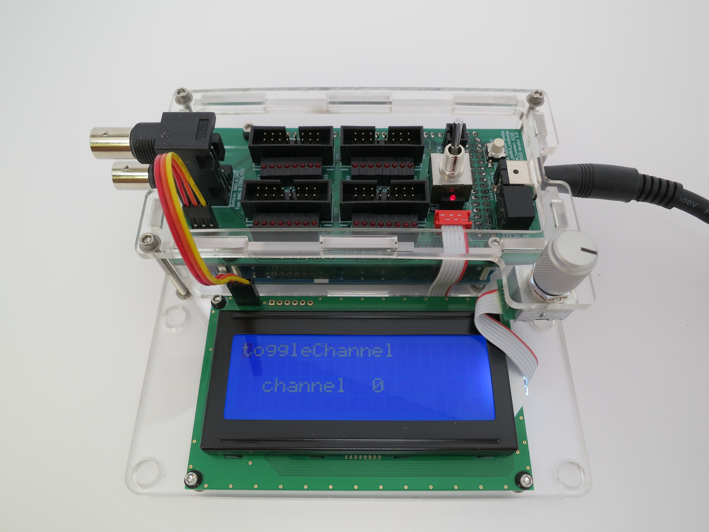

* When the modular device first powers up, the blinking cursor is in
  the upper left corner. Pressing the white button will execute
  whichever method is written on the first line of the display. In
  this example, the method is toggleChannel.

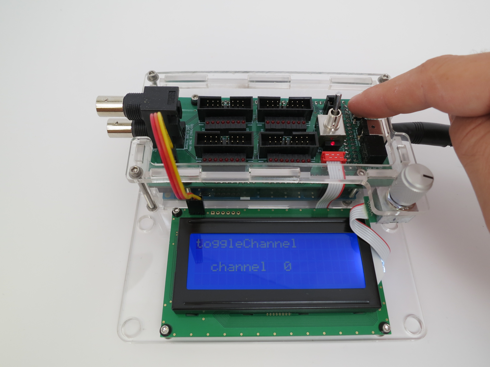

* In this example, pressing the white button toggles channel 0,
  turning it on if it was off and off if it was on. Note that the
  channel 0 LED is now lit.

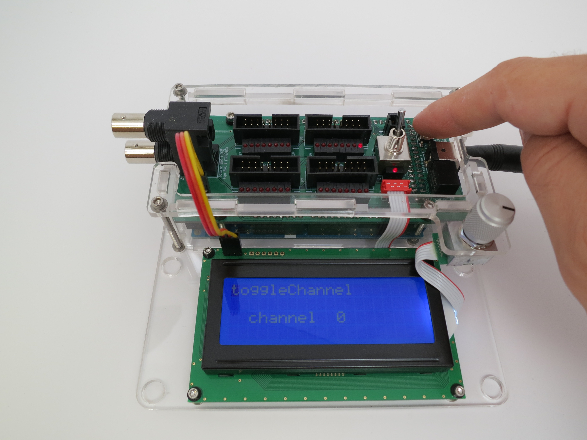

* Pressing down on the encoder button causes the blinking cursor to
  move to the next interactive variable on the display screen, if
  there is one. In this example, the channel number is an interactive
  variable, so pressing down on the encoder button once moves the
  cursor from the upper left corner (the device method interactive
  variable) to on top of the channel number. Pressing the encoder
  button again would cause the blinking cursor to jump back to the
  upper left corner again.

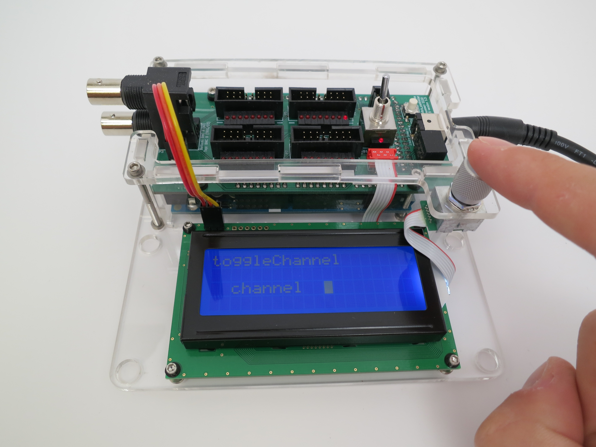

* Turning the encoder knob causes the interactive variable underneath
  the blinking cursor to change.

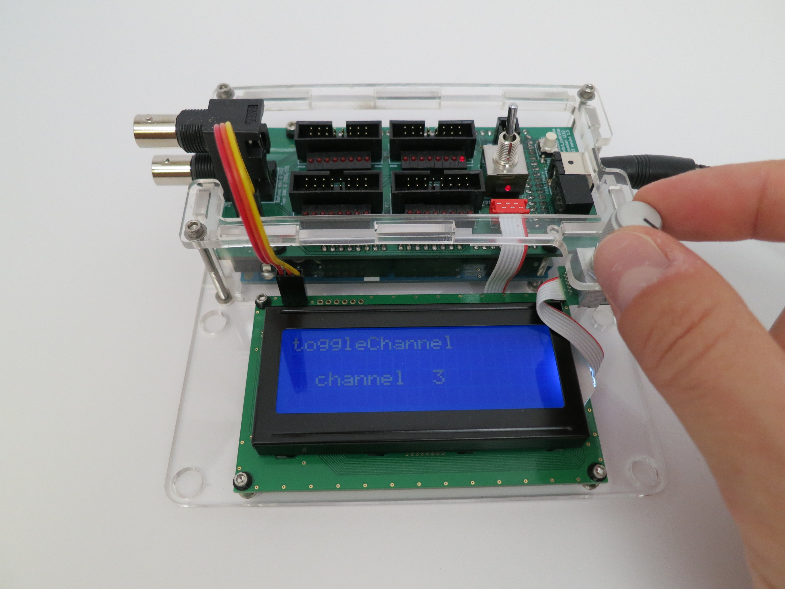

* Pressing the white button still causes the method on the top of the
  screen to execute, but with the new interactive variable values. In
  this example, pressing the white button causes LED 3 to light.

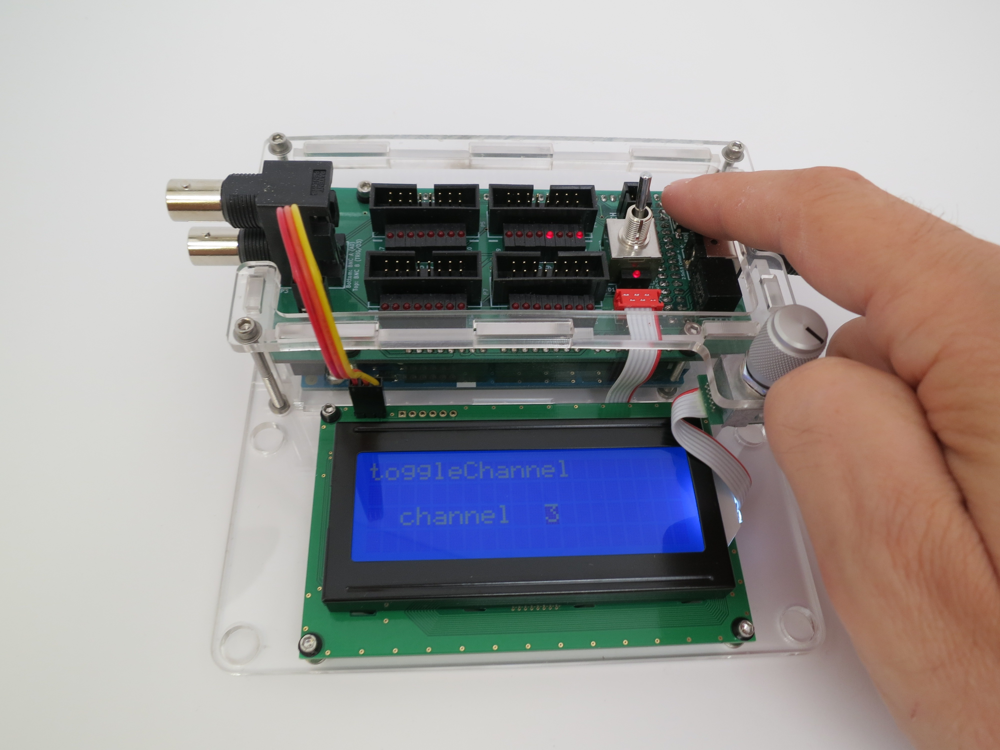

* Press the encoder button again to change the current interactive
  variable back to the device method (the blinking cursor back in the
  upper left corner of the screen).

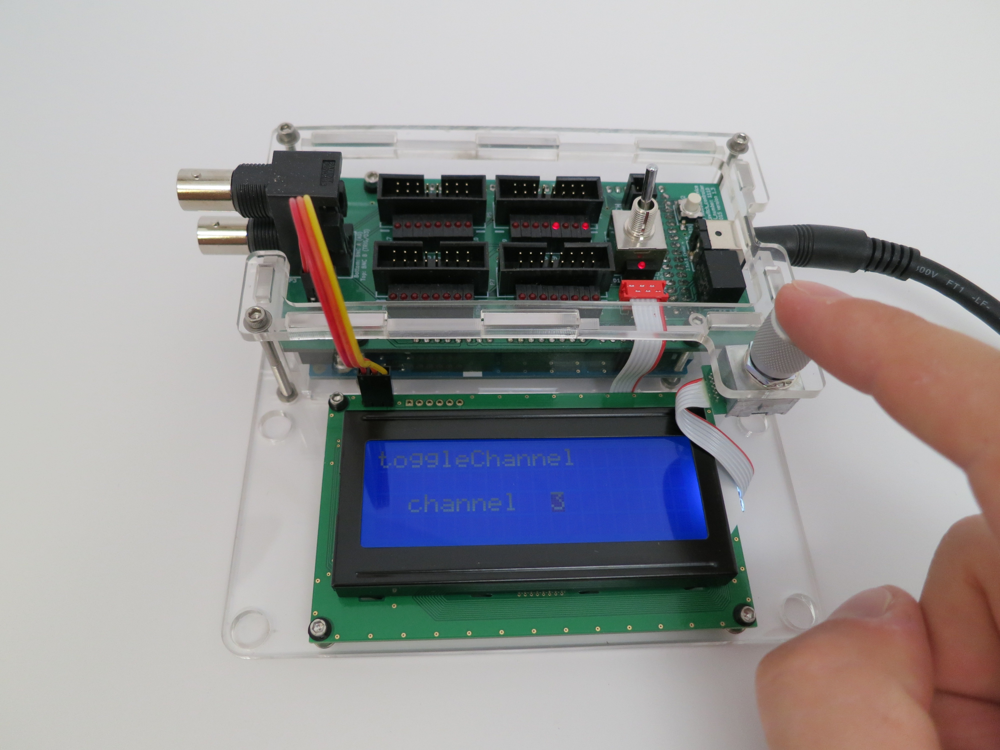

* Now when you turn the encoder knob, the device method changes. In
  this example, the device method changed to setAllChannelsOn.

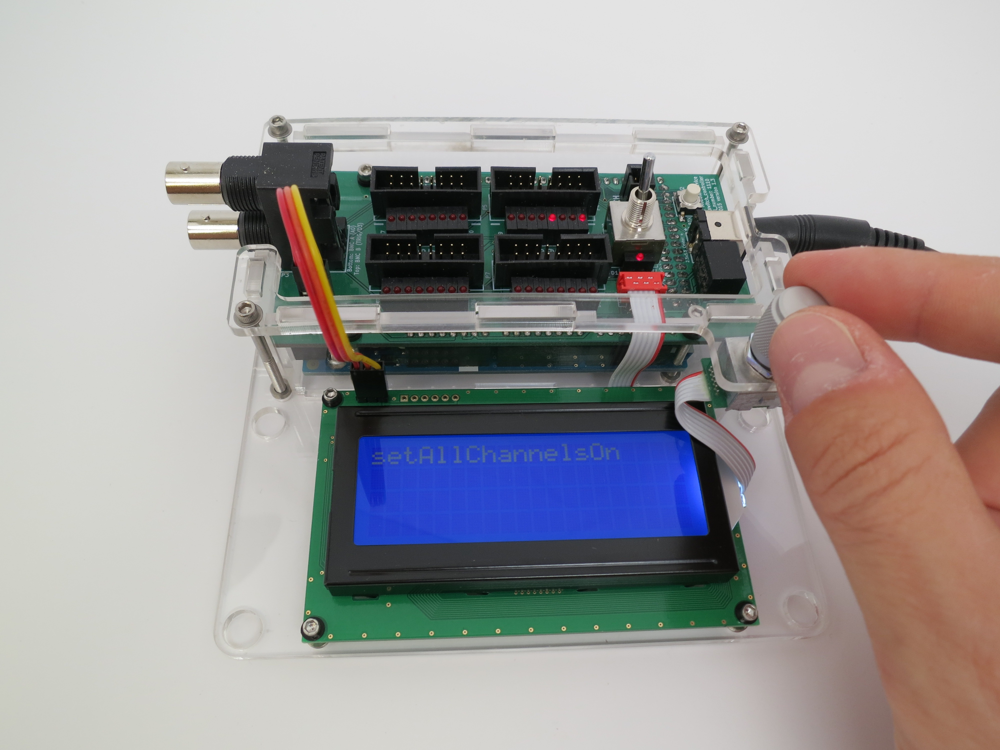

* Again, pressing the white button causes the current device method to
  execute.

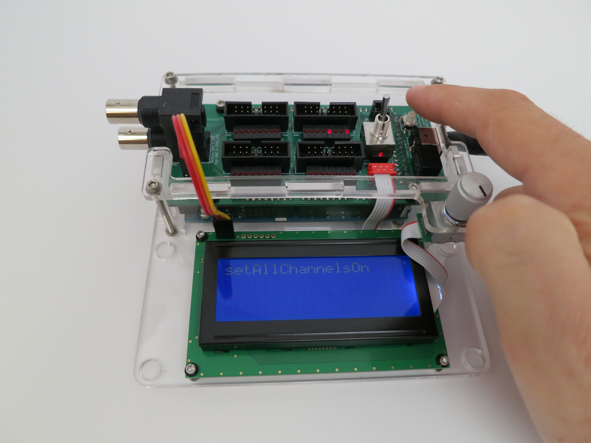

* All channels turn on and all LEDs are lit.

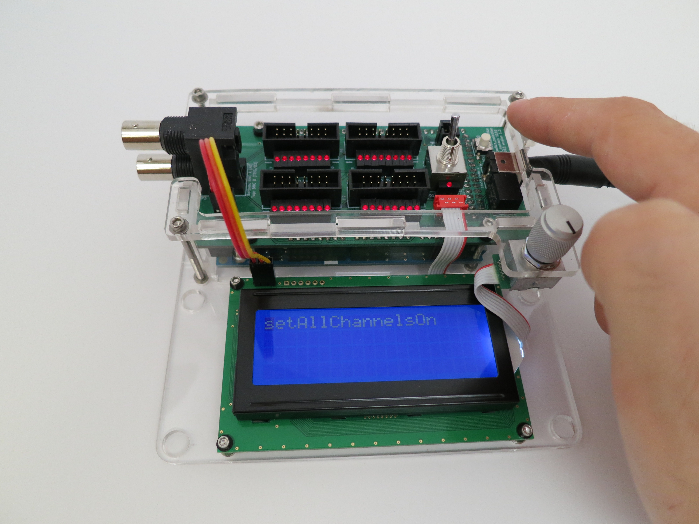

* The LEDs are useful for debugging, but some experiments require
  darkness so every modular device comes with a light switch.

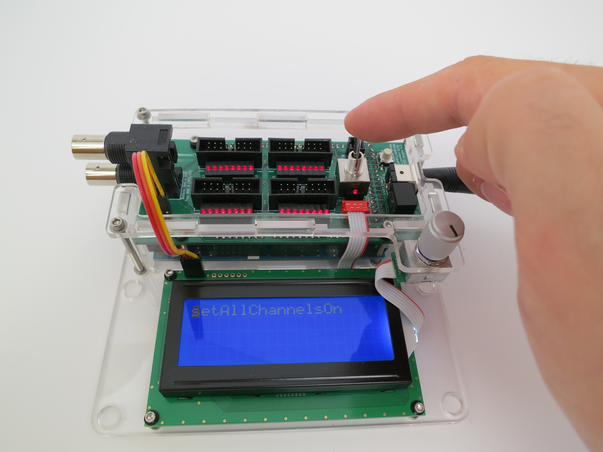

* Flipping the light switch turns the lights off, even though all of
  the channels are still on. The display still shows the text, but the
  display light is off making it more difficult to read.

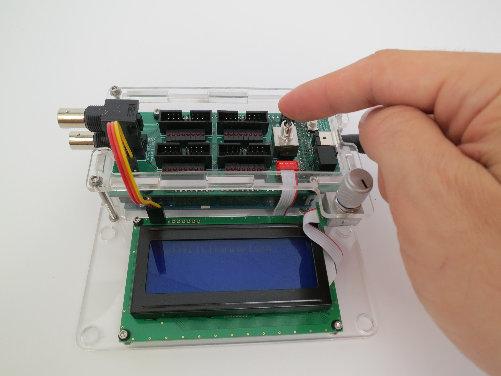

* Every modular device has a different set of methods and the methods
  exposed by the standalone interface are not necessarily the same as
  those exposed by the host computer interface over USB. The buttons
  and knobs work the same way for every modular device however.
